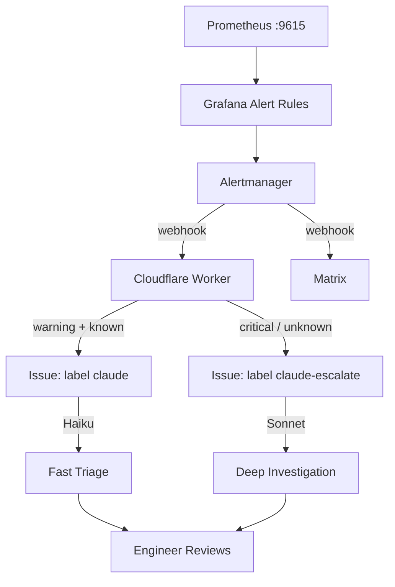

# grafana-github-bridge

Cloudflare Worker that converts Grafana Alertmanager webhook POSTs into GitHub issues, triggering a Claude Code agent to diagnose and act on bridge alerts.

## Flow



## Tiered model strategy

The worker routes alerts to different Claude models based on severity and category to optimize API costs:

| Condition | Label | Model | Cost |
|-----------|-------|-------|------|
| `severity=critical` | `claude-escalate` | Sonnet | ~$0.01/alert |
| `category=other` (unknown) | `claude-escalate` | Sonnet | ~$0.01/alert |
| Everything else | `claude` | Haiku | ~$0.001/alert |

Haiku handles ~90% of alerts (known categories, warning severity) at 1/10th the cost. Sonnet only runs for critical alerts or unrecognized patterns that need deeper investigation.

## Alert categories

| Category | Metric Pattern | Suggested Action |
|----------|---------------|------------------|
| `relay-down` | `up{container="bridges-common-relay"}` | Check relay pod status and restart |
| `version-guard` | Loki: `"Aborting"` in relay logs | Redeploy relay with new runtime |
| `headers-mismatch` | `*_is_source_and_source_at_target_using_different_forks` | Re-sync headers from canonical fork |
| `finality-lag` | `*_Sync_best_source_at_target_block_number` | Check relay logs and source chain finality |
| `delivery-lag` | `*_MessageLane_*_lane_state_nonces` (generated > received) | Check message relay process |
| `confirmation-lag` | `*_lane_state_nonces` (received vs confirmed) | Check confirmation relay |
| `reward-lag` | `*_lane_state_nonces` (confirmed src vs confirmed tgt) | Check reward mechanism |
| `low-balance` | `at_*_relay_*Messages_balance` | Top up relay account |

## Grafana configuration

### Contact point

```yaml
- orgId: 1
  name: GitHub parity-bridges-common
  receivers:
    - uid: github_parity_bridges_common
      type: webhook
      settings:
        url: https://grafana-github-bridge.parity-bridges.workers.dev
      disableResolveMessage: false
```

### Notification policy

Route bridge alerts to GitHub **and** continue to Matrix:

```yaml
- receiver: GitHub parity-bridges-common
  matchers:
    - alertname =~ ".*Bridge.*|.*bridge.*|.*headers mismatch"
  continue: true
```

`continue: true` ensures the alert also falls through to the default receiver (Matrix).

## Deploy

```bash
cd deployments/local-scripts/grafana-github-bridge
npm install
npx wrangler secret put GITHUB_TOKEN      # PAT with issues:write scope
npx wrangler secret put WEBHOOK_SECRET     # optional, shared secret
npx wrangler deploy
```

Deployed at `https://grafana-github-bridge.parity-bridges.workers.dev`.

## Test

```bash
# Local
npx wrangler dev
WORKER_URL=http://localhost:8787 node test.js

# Production (dry run — creates a real issue)
WORKER_URL=https://grafana-github-bridge.parity-bridges.workers.dev node test.js
```

## Monitor

- **Worker metrics**: Cloudflare dashboard → Workers → grafana-github-bridge
- **Logs**: `npx wrangler tail`
- **GitHub side**: search `label:alert label:claude` or `label:claude-escalate` in the repo issues
